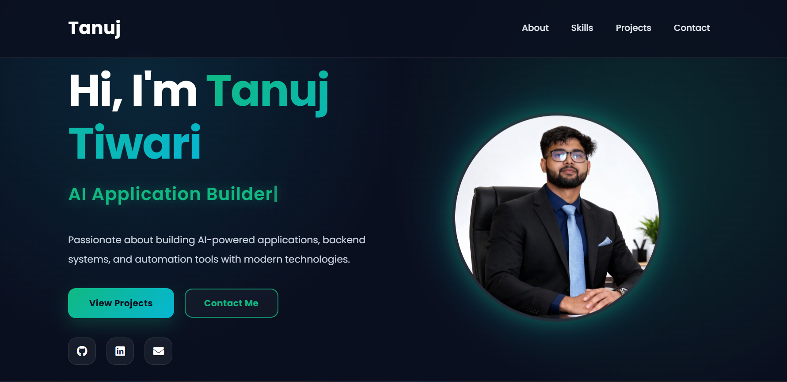

# 🚀 Tanuj Tiwari - Developer Portfolio

A modern, responsive personal portfolio website showcasing my technical skills, software projects, professional experience, and passion for web development, backend systems, and emerging AI technologies.

## 🌐 Live Demo

🔗 [Your Portfolio Link Here]

---

## ✨ Features

* Modern Premium Dark UI Design
* Fully Responsive Layout
* Smooth Scroll Animations
* Dynamic Typing Text Effect
* Interactive Skills Showcase
* Project Portfolio Section
* Resume Download Feature
* Professional Experience Section
* Contact & Social Links
* SCSS Modular Styling
* Optimized Production Build

---

## 🛠️ Tech Stack

### Frontend

* HTML5
* SCSS
* JavaScript (ES6)
* Bootstrap 4

### Libraries

* ScrollReveal.js
* Typed.js

### Build Tools

* Parcel Bundler

### Deployment

* Vercel

---

## 📂 Project Structure

```bash
src/
│
├── assets/
├── css/
├── js/
├── Tanuj_resume.pdf
└── index.html
```

---

## 📸 Portfolio Preview



---

## 🚀 Installation & Setup

### Clone repository

```bash
git clone https://github.com/YOUR_USERNAME/YOUR_REPOSITORY.git
```

### Install dependencies

```bash
npm install
```

### Run development server

```bash
npm start
```

### Build for production

```bash
npm run build
```

---

## 👨‍💻 Author

### Tanuj Tiwari

* GitHub: https://github.com/YOUR_USERNAME
* LinkedIn: https://linkedin.com/in/YOUR_LINKEDIN

---

## 📄 License

This project is licensed under the MIT License.
